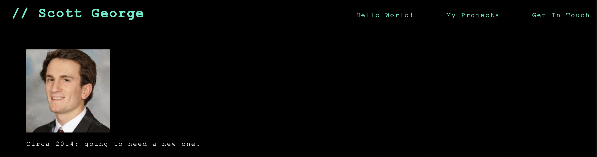
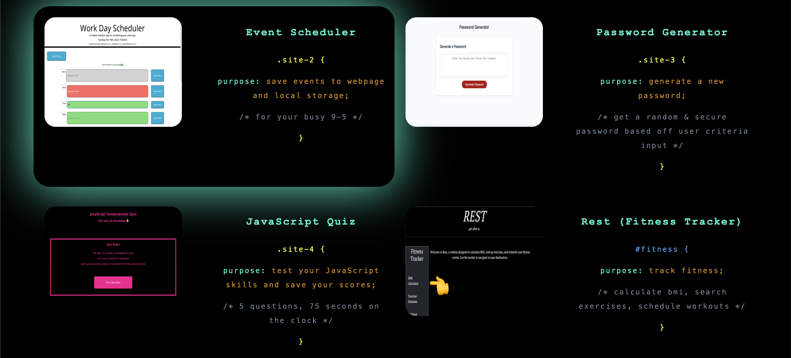

# sg-portfolio-website
The homepage of my web development portfolio site

## Description

This project was created to establish a homepage for my web development portfolio. This will act as a central hub for all of my projects as I am applying for jobs. In this field, it is essential to have your projects displayed so that potential employers have concrete examples of your work. This helps immensely because it truly *demonstrates* your coding skills. It may even be a requirement just to land an interview.

During this project, I learned how important and powerful CSS can be. It brings your HTML to life, provides organization to the elements, and can help create aesthetically beautiful webpages. I also learned about pseudo-classes and pseudo-elements which can add some cool effects, like a glow around a section's border when a user hovers their cursor over it or changing colors when highlighting text. A lot of time was spent researching the properties and values needed to do what I wanted with my HTML and can use these newly acquired CSS skills in all of my future projects.

A media query was added for responsiveness when using the site on a smaller screen. As always, the code is semantic for user accessibility.

## Usage 

Upon clicking the link to the webpage (see "Links" below), the user will be directed to a single page with a header and 3 sections. The user can navigate to each section using the nav bar links at the top right portion of the header. These sections provide a description about me, icons and text about my projects, and my contact info. I wanted to give the page a coding feel, in that each section is formatted and colored the same way as HTML, CSS, and JavaScript, respectively. When in the "My Projects" section, a light blue border glow is presented if the user hovers their cursor over the application. 4 out of the 5 application icons are just placeholders, as they are not coded yet, but plan to be created in the near future. The only site deployed and able to be clicked on is the "Accessible Webpage," created in Challenge 1. Click on the application image to be redircted to the page. In the "Get In Touch" section, the user is provided with contact info and can click on the GitHub link to be redircted to my GitHub profile. The user can also resize the screen to test the responsiveness.

## Links

Webiste URL:

    * https://scottsc0de.github.io/sg-portfolio-website/

GitHub Repository:

    * https://github.com/ScottsC0de/sg-portfolio-website

## Screenshots

